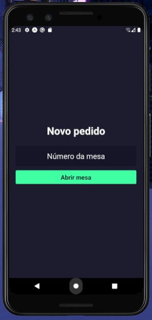
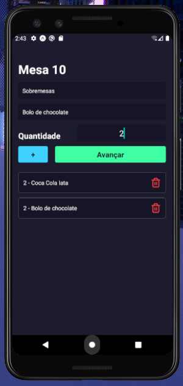
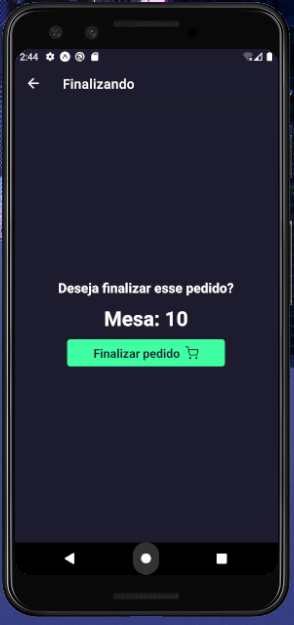

# Sujeito Pizzaria - Mobile

Bem-vindo ao repositório do aplicativo mobile do Sistema de Gestão de Pedidos da Sujeito Pizzaria!

## Visão Geral

Este aplicativo mobile foi desenvolvido utilizando React Native e Expo como parte do Sistema de Gestão de Pedidos da Sujeito Pizzaria. Ele fornece uma interface para os garçons, permitindo a abertura de mesas, anotação de pedidos e envio para o backend processar.

## Tecnologias Utilizadas

- **React Native**: Framework JavaScript para desenvolvimento de aplicativos móveis nativos.
- **Expo**: Plataforma e conjunto de ferramentas para criar aplicativos React Native com facilidade.

## Funcionalidades Principais

- **Abertura de Mesas**: Permite que os garçons abram novas mesas para os clientes.
- **Adição de Produtos**: Facilita a adição de produtos aos pedidos das mesas.
- **Envio de Pedidos**: Envia os pedidos registrados para o backend processar.

## Capturas de Tela

### Novo Pedido - Informar Número da Mesa

### Adicionar Produtos à Mesa

### Finalizar Pedido para o Backend

## Como Executar o Projeto Localmente

1. Certifique-se de ter o Node.js e o npm instalados em sua máquina.
2. Instale o Expo CLI globalmente: `npm install -g expo-cli`
3. Clone este repositório: `git clone https://github.com/felipergoncalves/Sujeito-Pizzaria-Mobile.git`
4. Navegue até o diretório do mobile: `cd Sujeito-Pizzaria-Mobile`
5. Instale as dependências do projeto: `npm install`
6. Inicie o servidor do Expo: `expo start`
7. Escaneie o QR Code com o aplicativo Expo Go em seu dispositivo móvel para visualizar o aplicativo em tempo real.

## Repositórios Relacionados

- **Backend**: [Link para o repositório do backend](https://github.com/felipergoncalves/Sujeito-Pizzaria-Backend)
- **Frontend**: [Link para o repositório do frontend](https://github.com/felipergoncalves/Sujeito-Pizzaria-Frontend)

## Contribuindo

Se deseja contribuir para este projeto, sinta-se à vontade para abrir uma issue ou enviar um pull request. Toda contribuição é bem-vinda!

## Autor

[Felipe Gonçalves](https://github.com/felipergoncalves)

